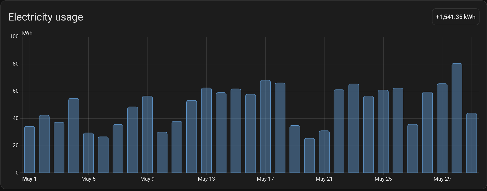

  

# Oklahoma Gas & Electric for Home Assistant

> [!WARNING]
> Development of this project made heavy use of AI tooling. I have been a software engineer for 10 years and have been a Senior Software Engineer for about 3 to 4 years, but this is still a personal project I built for my own Home Assistant instance because I wanted my OGE data in Home Assistant. I am sharing it in case others want their data too, but you assume all risks if you choose to use it.

Custom Home Assistant integration for Oklahoma Gas & Electric (OGE).

This integration signs into the OGE customer portal, discovers your available electric accounts, and imports hourly usage and hourly cost data into Home Assistant. It is designed to behave like a native utility integration instead of exposing a pile of daily-reset helper sensors.

## What it does

- Authenticates against the OGE customer portal
- Lets you select the OGE account to track during setup
- Downloads hourly usage history from OGE
- Imports hourly kWh and hourly cost into Home Assistant recorder statistics
- Supports Home Assistant Energy Dashboard using those imported statistics
- Exposes a small helper sensor set for quick reference:
  - estimated bill
  - price per kWh
  - latest hour peak demand

## Energy Dashboard support

This integration does not fabricate a lifetime meter reading. OGE provides interval usage data, so the integration imports external statistics directly into Home Assistant's recorder.

That means:

- historical data can be backfilled from OGE
- re-importing the same time range updates existing statistics instead of duplicating them
- corrected OGE data can replace older imported values cleanly

After the first successful sync, configure the Energy Dashboard to use the imported OGE energy statistic and imported OGE cost statistic for your grid source.

## Installation

1. Open HACS in Home Assistant.
2. Add this repository as a custom repository with category `Integration`.
3. Install `Oklahoma Gas & Electric`.
4. Restart Home Assistant.
5. Add the integration from `Settings -> Devices & Services`.

## Configuration

During setup, enter your OGE username and password, then choose the account you want Home Assistant to track.

After setup, the integration supports options for:

- initial history backfill window
- correction window for re-importing recently changed utility data

## Notes

- This integration currently targets electric usage data available from the OGE portal.
- Energy Dashboard should use the imported OGE statistics, not a daily-reset sensor.
- This repository is licensed under the MIT License. See [LICENSE](LICENSE).
- Release and changelog workflow details live in [RELEASING.md](RELEASING.md).
